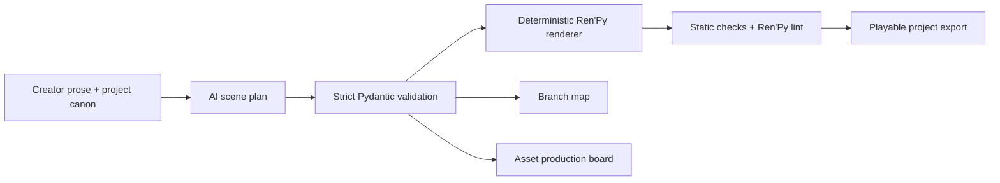

# VNForge

### This project was developed for IBM July's creative builders challenge. A proof of IBM usage as main development tool can be found in the html under the name "ibm_proof_july". Project actual development cycle was under a week.

### **Contributors (Alphabetical):**
Karthik: He is our main bug tester, without his observations and thorough analysis we would not have discovered the bugs and our project would not have been as good.

Siefeldin: Team lead and core-files developer. Fixed the reported bugs and implemented the newer features, as well as added UI adjustments.

Taha: Provided the initial UI code that the whole project was built around.

**Turn a story scene into a validated, playable visual-novel project—while keeping story branches, canon, and art production organized.**

VNForge is a desktop workspace for visual-novel writers, artists, and Ren'Py developers. Paste a prose scene, select the creative and branching settings, and VNForge creates an editable scene plan. A deterministic local compiler turns that plan into Ren'Py; the language model never writes executable `.rpy` code.

Built for the IBM watsonx Challenge.

## Why VNForge is different

Most AI writing tools stop after generating text. VNForge keeps the output usable throughout production:

- Produces deterministic Ren'Py from a strict, editable scene plan
- Validates identifiers, choice counts, asset references, labels, and jumps
- Saves complete `.vnforge` projects with unlimited scenes
- Imports prose, Markdown, and common statements from existing `.rpy` scripts
- Links selected routes to continuation scenes automatically
- Displays a project-wide branch and continuity map
- Maintains a character/story bible and world rules
- Deduplicates art and audio requirements into a production board
- Tracks asset variants, source files, status, dimensions, and scene usage
- Locks approved sections and regenerates only dialogue beats, choices, assets, or notes
- Preserves a bounded per-scene generation history and source-to-output comparison
- Supports undo, redo, preserve/adapt modes, cancellation, retries, and token estimates
- Exports a complete playable Ren'Py project with labeled placeholder assets
- Runs official Ren'Py lint when an SDK is configured, with static validation always available

## How it works



The provider may suggest story structure, but VNForge owns the code-generation boundary. State changes are typed values, routes are validated identifiers, and creator text is escaped before it enters a script.

## Quick start

Requirements:

- Python 3.10 or newer
- Internet access for model inference
- An IBM watsonx, Gemini, OpenRouter, OpenAI, Anthropic, or OpenCode Go API key

```bash
git clone https://github.com/Siefeldin-Sobih/VNForge.git
cd VNForge
python run.py
```

`run.py` installs the pinned runtime dependencies when they are missing. On first launch, choose a provider and validate the complete configuration. IBM users can select a region and load the currently available Granite models rather than relying on a stale hard-coded list.

## Creator workflow

1. Open **Project & Canon** and record the title, synopsis, world rules, and characters.
2. Paste a scene into **Creator prose**.
   Existing `.txt`, `.md`, and `.rpy` files can also be loaded with **Import**.
3. Select genre, branching depth, and adaptation mode:
   - **Preserve** keeps wording and sequence wherever possible.
   - **Balanced** adapts pacing without changing facts.
   - **Adapt** allows more visual-novel restructuring while respecting canon.
4. Select a previous route under **Continue from** when the scene follows an existing choice.
5. Compile the scene.
6. Review the deterministic script, choices, asset board, story map, and diagnostics.
7. Edit the JSON in **Scene Plan**, then click **Apply Plan Edits** to validate and rerender it.
8. Lock approved sections or regenerate only the active section.
9. Save the portable `.vnforge` project.
10. Export a scene report, asset CSV, `.rpy` file, or complete playable project.

The **Project JSON** tab is an advanced editor for every persisted field. Changes are rejected unless the complete file passes the project schema.

## Art-production workflow

Each visual or audio cue becomes one deduplicated project asset. Open **Asset Board** to update its production state:

- `planned`
- `in_progress`
- `ready`
- `approved`

Character cues can specify pose or expression variants. Every item lists the scenes that use it, and the CSV export can be opened in a spreadsheet or imported into another production tracker.

When no finished asset is attached, playable export creates a labeled SVG placeholder for backgrounds and sprites or a short silent WAV for audio. This keeps early projects runnable without pretending temporary output is final art.

## Story branches and continuity

The Story Map shows every scene and route target. VNForge currently checks for:

- Duplicate scene and route identifiers
- Scenes unreachable from the project's first scene
- Missing branch targets
- Variable type changes
- Undeclared beat assets
- Asset type or description drift
- Speakers absent from the story bible
- Attached asset files that no longer exist
- Duplicate or missing Ren'Py labels

Selecting a route before compiling a new scene records the continuation in the project and updates the predecessor choice to jump to the new scene.

## Playable Ren'Py export and lint

**Playable Project** creates:

```text
<project>_renpy/
├── VNFORGE_EXPORT.txt
└── game/
    ├── script.rpy
    ├── options.rpy
    ├── images/
    └── audio/
```

VNForge always checks label and jump consistency. For official lint, set `RENPY_EXECUTABLE` in `.env` to the Ren'Py launcher script or executable:

```dotenv
RENPY_EXECUTABLE="/absolute/path/to/renpy.sh"
```

The app invokes the documented `lint --error-code` workflow and reports the result after export.

## AI providers

| Provider | Setup | Notes |
|---|---|---|
| **IBM watsonx.ai** | API key, project ID, region, model | Recommended. VNForge fetches current Granite models for the selected region and verifies a minimal project inference. |
| **Google Gemini** | API key, model | Loads currently available Flash models and uses JSON response mode. |
| **OpenRouter** | API key, model | Loads the currently advertised free models; paid models may also be configured. |
| **OpenAI** | API key, model | Connects directly to OpenAI, loads text-generation models available to the key, and requests JSON output. |
| **Anthropic** | API key, model | Connects directly to Anthropic, loads available Claude models, and uses structured output when the selected model supports it. |
| **OpenCode Go** | API key, model | Uses the low-cost Go subscription, loads its live model catalog, validates the chosen model, and routes each model through its documented compatible endpoint. |

Hosted model catalogs and pricing change. VNForge therefore validates live provider configuration, uses bounded rate-limit/server retries, and repairs malformed JSON before rejecting a generation.

## Security and privacy

- API secrets are stored in the operating-system keyring when an operational backend is available.
- The `.env` fallback is restricted to owner-only permissions where supported and is ignored by Git.
- Creator prose is sent only to the provider selected in setup.
- Project files do not contain provider credentials.
- Model output is parsed into a strict `ScenePlan`; unknown fields are rejected.
- Ren'Py is generated locally from safe operations and typed literal values.
- Export filenames are sanitized and cannot escape the selected destination.

Review any exported game before distribution. Ren'Py itself supports Python, but VNForge's renderer does not generate arbitrary Python statements.

## Development and tests

Install development tools and run the full local checks:

```bash
python -m pip install -r requirements-dev.txt
ruff check .
python -m pytest tests -v
python -m compileall -q app.py run.py core tests
```

The regression suite covers strict schemas, prompt-output repair, cancellation, locked-section regeneration, text escaping, semantic validation, route namespacing, project save/load, undo/redo, continuation linking, safe filenames, asset placeholders, and playable export. GitHub Actions runs the checks on Python 3.10, 3.12, and 3.14.

## Project structure

```text
VNForge/
├── app.py                    # Desktop project workspace and provider setup
├── run.py                    # Dependency-aware entry point
├── core/
│   ├── compiler.py           # Scene planning and deterministic compile pipeline
│   ├── exporters.py          # Reports, CSV, placeholders, and playable projects
│   ├── model_client.py       # Provider adapters, live models, retry, and repair
│   ├── project.py            # Persistence, history, and asset registry
│   ├── prompts.py            # Delimited planning prompts and project canon
│   ├── renderer.py           # Safe Ren'Py renderer
│   ├── schemas.py            # Strict scene and project contracts
│   ├── settings.py           # Keyring-first provider settings
│   └── validation.py         # Scene, project, continuity, and lint checks
├── samples/                  # Prose examples
├── tests/                    # Offline regression suite
├── requirements.txt          # Pinned runtime dependencies
└── requirements-dev.txt      # Pinned development checks
```

## Current limitations

- Cancellation takes effect after an in-flight HTTP request returns; it does not forcibly terminate the provider connection.
- Official lint requires a local Ren'Py SDK path. Static validation remains available without one.
- Continuity analysis is deterministic and intentionally conservative; it highlights likely conflicts for creator review rather than silently rewriting canon.
- Generated content and asset briefs still require human editorial and artistic judgment.

VNForge is available under the MIT License.
